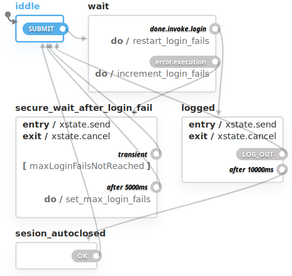

# task_manager

Task manager is an app created to simplifies and bring equality to the process of divide tasks, primarily thought to home-related tasks.

## Philosophy behind the project

This project is intended to be an application of all the stuff I've learned from software development in general and full-stack development in particular. Thus, I intentionally avoid using boilerplates, not because they lack utility, but because my aim here is to test my knowledge and make the experiment of building things from scratch.

## Technologies used

- React
- Node
- Express
- Webpack
- Typescript
- [XState](https://xstate.js.org/docs/)

## v0.0.1

**0.0.1 Milestones**:
- [x] Class diagram.
- [x] Database diagram. 
- [x] Autentication flow, frontend.
- [ ] Classes implementation.
- [ ] Database connection.
- [ ] API creation.
- [ ] New task viewer
- [ ] Pending tasks viewer
- [ ] Stats viewer

## The Statecharts and documentation

Statecharts are a formalism for modeling stateful, reactive systems. This project has been created to experiment with this concept. For the pourpose, I have used the XState library for creating, interpreting, and executing statecharts.

Statecharts are also a good way to document a system. Below is the diagram corresponding to the authentication flow(frontend): 

    

Below is showed that the system has several states, depending on the actions performed by the user. The first state is __iddle__, where the user only can send credentials and send the __SUBMIT__ transition to the __wait__ state. In this state the correspondent transition is performed automatically by the system, and depending on the authentication success (which carries the system to the __logged__ state) or failed (which carries the system to the __secure_wait_after_login_fail__ state).

Being in the __secure_wait_after_login_fail__ state means the system will fire automatically one transition conditionally. If there have been less than 5 authentication attempts, the system will return to the __iddle__ state. Elsewhere, the system will fallback to a timeout, where the login will be disabled temporally, and then will be automatically fired a transition, also to the __iddle__ state.

In the __logged__ state, the system will have nested states to allow the authenticated user activity (to_do). There is also one last first-order state which is __sesion_autoclosed__, in which the __logged__ state falls due to user inactivity. This state has a transition performed by the user to the __iddle__ state.

## Rules, good practices

### tl;dr

> Each state in machine state is related to a page. Each transition can be a user interaction (Button) or a transition (Promise resolved/rejected, timer). But must not be strictly related to the components.

### States and pages

Each state is related to a page. Each transition can be a user interaction (Button) or a transition (Promise resolved/rejected, timer). This is a powerful concept when drawing a state machine. But this should not be taken strictly into account when creating react components since it can be detrimental to the abstraction and re-utilization. Also, this can be detrimental to performance. This is because when dealing with different layers of the architecture(the business layer, solved by the state-machine model, and the UI layer, solved by the reactive model)  some objects may apparently have a counterpart in the other layer. But this is a problem related to the creation of the objects itself. This is, in essence, always an abstraction. An arbitrary decision is taken to establish the cut in reality and to make phantasmagorically appear our objects. This desition can be taken more or less accurately, taking us to better or worse software design. But can never be infallible. the Achilles heel of object-oriented programming rests here. Enough talk, some code illustration of those concepts:

#### The case of the orphan state

The first approcach that turns to me out when designing the state machine was this:

    

this doesn't match very well with the maxim "Each state in the finite-machine-state is related to a page." because we have an __"orphan state"__ here. You see that? Yes, it's the __error__ state. This is because the state-machine can be semplified. Error state is no more than a part of __secure_wait_after_login__ state. This way, we simplified the state machine by making an observation in another layer of the architecture.
